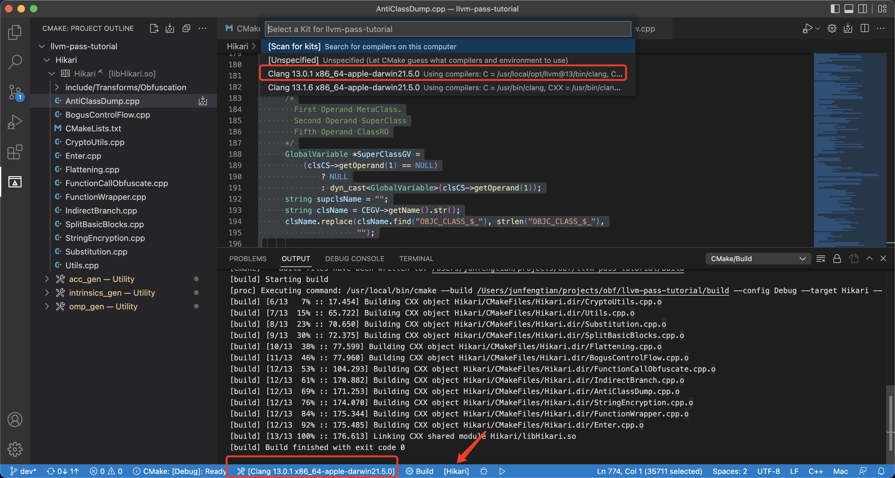

# ollvm/armariris port to llvm10 in 2020

# skeleton port to llvm14 in 2022

# Hikari port to llvm14 in 2022 by [HimekoEx](https://github.com/HimekoEx)


# install llvm

```shell
brew install llvm@13
```

# Visual Studio Code

* install CMake 
* install CMake Tools
* install C/C++


